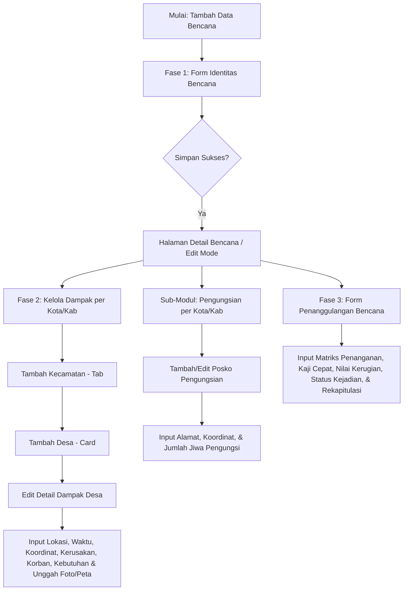

# Dokumentasi Modul Data Bencana - BARATA
*(Jawa Barat Berbudaya Tangguh Bencana)*

Dokumen ini berisi pemetaan detail, alur kerja (workflow), struktur data, serta spesifikasi fitur pada **Modul Data Bencana** aplikasi BARATA yang saat ini dikelola oleh Pusdalops BPBD Provinsi Jawa Barat. Dokumentasi ini disusun sebagai acuan utama (blueprint) dalam rangka re-engineering aplikasi dari framework legacy (PHP 7.3 & CodeIgniter) menuju arsitektur modern.

---

## 1. Arsitektur Alur Kerja (Workflow) Modul Data Bencana

Pengelolaan data bencana di BARATA mengikuti alur sekuensial tiga fase utama. Pengisian form harus diselesaikan secara berurutan karena data di tingkat wilayah (Dampak) dan respon penanggulangan bergantung pada entitas utama bencana yang didefinisikan di awal.

---

## 2. Struktur Tampilan Utama & Aksi (List View)
* **URL Utama**: `https://barata.jabarprov.go.id/bencana`
* **Filter Utama**: 
  * **Kondisi Bencana** (Dropdown): Menyaring data berdasarkan status kedaruratan aktif: `Normal`, `Siaga Darurat`, `Tanggap Darurat`, `Transisi Darurat`, `Pengakhiran`.

### Kolom Tabel Data Bencana
| No | Nama Kolom | Jenis Data / Tampilan | Penjelasan / Sumber Data |
|----|------------|----------------------|--------------------------|
| 1  | `No`       | Integer              | Nomor urut baris data. |
| 2  | `Opsi` (1) | Badge Teks           | Nama instansi/OPD pelapor (misal: `BPBD`, `DAMKAR`). |
| 3  | `Kota/Kab` | Teks                 | Wilayah kabupaten/kota tempat bencana terjadi. |
| 4  | `Diperbarui`| DateTime            | Waktu terakhir data diperbarui (`YYYY-MM-DD HH:MM:SS`). |
| 5  | `Tgl Kejadian`| DateTime          | Waktu terjadinya bencana (`DD/MM/YYYY HH:MM`). |
| 6  | `Kejadian` | Teks                 | Nama sub-kejadian bencana (misal: `Banjir Bandang`). |
| 7  | `Status`   | Badge Warna          | Status keparahan (`Hijau` / Mulai, `Kuning` / Dalam Proses Penanganan Bencana, `Merah` / Selesai). |
| 8  | `Opsi` (2) | Kumpulan Ikon/Tombol | Akses cepat ke fungsi manajemen dokumen dan riwayat. |

### Detail Tombol Aksi Kanan (Opsi 2)
1. **Edit Bencana (Ikon Pensil Biru)**: Mengarahkan ke form edit data utama bencana. *(Catatan: Terdapat issue di mana tombol edit terkadang tidak merespon/mati karena penulisan `javascript:void(0)` yang tidak terikat handler dengan benar. Link alternatif langsung: `/bencana/form/{id}`)*.
2. **Upload SK (Ikon Awan Biru)**: Mengarahkan ke halaman `/bencana/sk/{id}` untuk mengunggah dokumen surat keputusan kedaruratan.
3. **Hapus (Ikon Tong Sampah Merah)**: Menghapus data bencana dengan konfirmasi pop-up.
4. **Riwayat (Ikon Undo Hijau)**: Mengarahkan ke `/bencana/riwayat/{id}` untuk melihat log pembaruan versi laporan.
5. **Cetak PDF (Ikon PDF Merah)**: Mengunduh laporan bencana dalam format PDF resmi `/bencana/laporan/{id}`.
6. **Lihat Laporan (Ikon Dokumen Hijau)**: Membuka visualisasi laporan HTML interaktif di tab baru `/bencana/laporan_view/{id}`.
7. **Copy Link Laporan (Ikon Rantai Hitam)**: Memunculkan modal berisi link publik untuk membagikan laporan bencana tersebut.
8. **Dokumen (Ikon List Hijau)**: Mengarahkan ke `/bencana/dokumen/{id}` untuk melihat semua galeri foto bukti dan peta terdampak dari desa-desa.

---

## 3. Detail Form 1: Identitas Bencana (Fase 1)
* **URL Tambah**: `https://barata.jabarprov.go.id/bencana/form`
* **URL Edit**: `https://barata.jabarprov.go.id/bencana/form/{id}`

Form ini digunakan untuk menginisialisasi kejadian bencana pertama kali.

| Nama Field | Tipe Input | Status | Keterangan & Perilaku Dropdown |
|------------|------------|--------|---------------------------------|
| **OPD** | Select2 Dropdown | **Wajib** | Pilihan instansi pelapor (e.g., `BPBD`, `DAMKAR`). |
| **Jenis Kejadian** | Select2 Dropdown | **Wajib** | Klasifikasi bencana utama (e.g., `Banjir`, `Tanah Longsor`, `Kebakaran Hutan`). |
| **Nama Kejadian** | Select2 Dropdown | **Wajib** | Sub-jenis bencana. List opsi berubah secara dinamis berdasarkan *Jenis Kejadian* yang dipilih. |
| **Tanggal Kejadian** | Date Picker | **Wajib** | Tanggal terjadinya bencana (`mm/dd/yyyy`). |
| **Waktu Kejadian** | Time Picker | **Wajib** | Jam terjadinya bencana (`HH:MM`, format 24 jam). |
| **Kab/Kota** | Select2 Dropdown | **Wajib** | Lokasi kabupaten/kota administrasi utama tempat terjadinya bencana. |
| **Penyebab Kejadian** | Select2 Dropdown | **Wajib** | Faktor pemicu bencana (opsi menyesuaikan secara dinamis berdasarkan *Nama Kejadian*). |
| **Keterangan Penyebab / Kronologi** | Summernote Rich Editor | Opsional | Deskripsi kronologi detail kejadian bencana. |
| **Analisa Penyebab Kejadian** | Summernote Rich Editor | **Wajib** | Kajian teknis mengapa bencana tersebut terjadi. |
| **Latitude & Longitude** | Text Input & Peta Interaktif | **Wajib** | Koordinat episentrum bencana. Pengguna bisa mengetik manual atau mengklik titik pada **Peta Leaflet** yang terintegrasi. |

---

## 4. Detail Form 2: Dampak Bencana (Fase 2)
* **URL Kelola Dampak**: `https://barata.jabarprov.go.id/bencana/form_dampak/{city_id}/{disaster_id}`

Fase ini memetakan dampak kerusakan dan korban secara hierarkis per Kecamatan hingga tingkat Desa/Kelurahan.

### Alur Input Wilayah Dampak:
1. **Tambah Kecamatan (Tab)**: Memilih Kecamatan pada dropdown lalu klik **TAMBAH**. Setiap kecamatan yang ditambahkan akan muncul sebagai tab navigasi horizontal.
2. **Tambah Desa (Card)**: Di dalam tab kecamatan yang aktif, pengguna memilih Desa pada dropdown lalu klik **TAMBAH**. Desa yang sukses ditambahkan akan terdaftar sebagai card persegi di bawah tab kecamatan.
3. **Form Detail Dampak Desa**: Diklik via tombol **EDIT** pada card desa. Mengarah ke URL: `https://barata.jabarprov.go.id/bencana/edit_desa/{desa_id}`.

### Field Detail Dampak Desa:
Form detail dampak desa terbagi menjadi beberapa bagian utama:

#### A. Informasi Umum
* **Detail Lokasi**: textarea / Summernote editor (Wajib) untuk menginput lokasi spesifik.
* **Waktu Terdampak**: Time input (Wajib).
* **Koordinat**: Input Latitude/Longitude & Leaflet Map picker (Wajib).

#### B. Data Kerusakan (Dinamis)
Memungkinkan admin menambahkan banyak entri kerusakan sekaligus (multi-add) dengan parameter:
* **Kategori Kerusakan**: Rumah, Tempat Ibadah, Fasilitas Pendidikan, Kantor, Fasilitas Kesehatan, Jembatan, Jalan, dll.
* **Tingkat Kerusakan**: Rusak Berat (RB), Rusak Sedang (RS), Rusak Ringan (RR), Terendam.
* **Jumlah Unit**: Input angka (Integer).
* **Keterangan**: Deskripsi detail kerusakan (teks bebas).

#### C. Prasarana Vital
Checkbox status kelumpuhan prasarana vital:
* Jembatan terputus, Jalan terputus, Jaringan Air Bersih mati, Listrik padam, Jaringan Komunikasi terganggu.
* Pilihan tingkat keparahan per prasarana (Berat, Sedang, Ringan).

#### D. Data Korban (KK dan Jiwa)
Terbagi menjadi 5 kategori kondisi korban dengan input terpisah untuk jumlah **KK (Kepala Keluarga)** dan **Jiwa (Orang)**:
1. **Menderita / Terdampak**: Korban yang terdampak langsung secara sosial/ekonomi.
2. **Mengungsi**: Korban yang terpaksa pindah ke posko pengungsian.
3. **Terancam**: Korban yang berada di zona bahaya aktif namun belum mengungsi.
4. **Meninggal Dunia**: Korban meninggal (memiliki opsi Checklist "Lengkapi" untuk mengisi detail identitas jenazah jika diperlukan).
5. **Hilang**: Korban yang masih dalam pencarian.

#### E. Kebutuhan & Lampiran File
* **Kebutuhan Mendesak**: Textarea deskripsi kebutuhan logistik khusus desa tersebut.
* **Luas Terdampak (Ha)**: Luas lahan terdampak dalam satuan Hektar (Decimal).
* **Gambar (Wajib)**: Upload foto bukti visual kerusakan/bencana di lapangan (Format PDF/Image).
* **Peta (Wajib)**: Upload lampiran sketsa atau peta sebaran terdampak (Format PDF/Image).

---

## 5. Sub-Modul: Pengungsian
* **URL**: `https://barata.jabarprov.go.id/bencana/pengungsian/{city_id}/{disaster_id}`
* **Form Tambah**: `https://barata.jabarprov.go.id/bencana/form_pengungsian/{city_id}/{disaster_id}`

Digunakan untuk mencatat titik posko pengungsian spesifik di wilayah kabupaten/kota terdampak apabila terdapat jumlah korban mengungsi.

* **Daftar Shelter**: Menampilkan tabel posko aktif dengan kolom `Lokasi`, `Alamat`, dan `Jumlah Pengungsi`.
* **Field Input Form**:
  1. **Alamat**: Area alamat lengkap posko (Summernote editor, Wajib).
  2. **Latitude & Longitude**: Koordinat koordinat geografis posko & Map Picker Leaflet (Wajib).
  3. **Jumlah Pengungsi**: Total jumlah jiwa pengungsi yang ditampung (Integer, Wajib).

---

## 6. Detail Form 3: Penanggulangan Bencana (Fase 3)
* **URL**: `https://barata.jabarprov.go.id/bencana/form_3/{disaster_id}`

Form ini diakses melalui tombol **FORM PENANGGULANGAN** di kanan atas halaman kelola dampak. Berfungsi untuk merangkum seluruh upaya penanganan yang dilakukan oleh instansi pemerintah dan menetapkan status akhir laporan.

| Nama Field | Tipe Input | Status | Penjelasan & Perilaku Fitur |
|------------|------------|--------|-----------------------------|
| **Kategori Penanganan** | Checkbox Matrix | **Wajib** | Matriks pilihan penanganan yang dilakukan oleh tingkat **Provinsi** dan/atau **Kab/Kota** untuk kategori:  1. *Kaji Cepat Dampak Bencana*  2. *Penyelamatan & Evakuasi*  3. *Pemenuhan Kebutuhan Dasar*  4. *Perlindungan Kelompok Rentan*  5. *Pemulihan Darurat Prasarana Vital* |
| **Keterangan Kaji Cepat** | Summernote Editor | **Wajib** | Deskripsi hasil kaji cepat penanganan. *(Catatan user: Diinginkan fitur auto-fill template karena isinya mayoritas seragam, hanya berbeda nama kota/kab)*. |
| **Kondisi Terkini** | Summernote Editor | **Wajib** | Update status situasi di lapangan saat laporan ini ditutup/diupdate. |
| **Nilai Kerusakan & Kerugian** | Number Input (IDR) | **Wajib** | **Nilai Kerusakan**: Estimasi nilai aset fisik yang hancur.  **Nilai Kerugian**: Estimasi kerugian ekonomi/pendapatan. *(Catatan: Ke depan disarankan menggunakan rumus kalkulasi otomatis dari akumulasi kerusakan fisik di desa)*. |
| **Status Kejadian** | Select2 Dropdown | **Wajib** | Klasifikasi warna tingkat keparahan bencana saat ini:  🟢 **Hijau** (Aman/Normal)  🟡 **Kuning** (Waspada/Siaga)  🔴 **Merah** (Darurat/Bahaya) |
| **Penerima Informasi** | Text Input | **Wajib** | Nama personil Pusdalops yang menerima laporan masuk pertama kali. |
| **Sumber Informasi** | Text Input | **Wajib** | Instansi/pihak yang melaporkan bencana (otomatis terisi nama kota/kab utama). |
| **Tgl & Waktu Terima Laporan** | Date & Time Picker | **Wajib** | Waktu diterimanya informasi awal bencana di Pusdalops. |
| **Masuk Rekapitulasi** | Radio Button | **Wajib** | Pilihan `Ya` atau `Tidak`. Menentukan apakah kejadian ini dimasukkan ke dalam visualisasi statistik rekap bulanan/tahunan publik. |
| **Kebutuhan Mendesak** | Summernote Editor | **Wajib** | Kebutuhan darurat gabungan seluruh wilayah terdampak yang belum terakomodasi. |

---

## 7. Modul Pendukung & Aksi Tambahan

### A. Upload SK (Surat Keputusan)
* **URL**: `https://barata.jabarprov.go.id/bencana/sk/{id}`
* Mengunggah dua jenis dokumen legalitas kedaruratan daerah:
  1. **SK Tanggap Darurat**: Dokumen penetapan status darurat oleh kepala daerah (Bupati/Walikota/Gubernur) berupa file PDF/Gambar.
  2. **SK Verifikasi**: Dokumen verifikasi kejadian oleh BPBD/OPD terkait.

### B. Riwayat Laporan (History & Revisions)
* **URL**: `https://barata.jabarprov.go.id/bencana/riwayat/{id}`
* **Riwayat Laporan Terakhir**: Menampilkan versi laporan terkini dan operator pengubahnya.
* **Riwayat Laporan Sebelumnya (Version Control)**: Daftar snapshot versi laporan terdahulu.
  * Terdapat tombol **Lihat** yang mengarah ke `/bencana/laporan_copy/{report_version_id}` untuk melihat status data secara read-only pada waktu revisi tersebut dibuat.
  * Tombol **Hapus** untuk membersihkan history lama dari database.
  * Tombol **UPDATE** untuk memulihkan/mengaktifkan kembali data riwayat lama menjadi versi aktif saat ini.

### C. Dokumen Galeri Bukti
* **URL**: `https://barata.jabarprov.go.id/bencana/dokumen/{id}`
* Repositori terpusat yang menampilkan semua foto dokumentasi kejadian dan file peta terdampak yang diunggah dari seluruh desa pada Fase 2. Dilengkapi dengan pratinjau thumbnail dan tautan unduhan langsung ke direktori penyimpanan `/data/bukti_kejadian/{filename}`.

---

## 8. Catatan Teknis untuk Re-Engineering (Rekomendasi Developer)

Selama proses re-engineering sistem dari CodeIgniter/PHP 7.3 lama, berikut adalah poin-poin krusial yang perlu diperhatikan dan ditingkatkan:

1. **Optimasi Tombol Edit Bencana**:
   * *Masalah saat ini*: Kadang tidak merespon karena penggunaan `href="javascript:void(0)"` tanpa event handler jquery yang andal.
   * *Solusi Baru*: Di stack modern (misal Next.js atau React/Vue), gunakan routing dinamis yang bersih (contoh: `/bencana/edit/[id]`) menggunakan komponen Router bawaan framework (bukan tag anchor biasa).
2. **Kalkulasi Otomatis Nilai Kerusakan & Kerugian**:
   * *Masalah saat ini*: Nilai kerusakan diinput manual oleh admin di Form 3 secara tebakan kasar.
   * *Solusi Baru*: Buat sistem rumus (formula) yang secara otomatis menghitung estimasi nilai kerusakan berdasarkan akumulasi jumlah unit bangunan yang hancur di Form Desa (dikali dengan standar harga satuan bangunan per kategori kerusakan di Jawa Barat). Admin tetap diberikan field "Override Manual" jika ingin mengoreksi nominal tersebut.
3. **Template Otomatis Kaji Cepat**:
   * *Masalah saat ini*: Admin mengetik ulang laporan kaji cepat secara manual.
   * *Solusi Baru*: Sediakan fitur "Generate Template" yang secara otomatis mengambil variabel nama kota, jenis bencana, waktu, dan jumlah korban jiwa terakumulasi untuk dijadikan draf teks kaji cepat instan di editor Summernote/ProseMirror.
4. **Penyimpanan Koordinat & Peta Interaktif**:
   * *Masalah saat ini*: Integrasi Leaflet sering lambat saat load peta pertama kali.
   * *Solusi Baru*: Lakukan lazy-loading komponen peta dan gunakan cache lokal (IndexedDB/State Management) untuk mempercepat pencarian data spasial wilayah Jawa Barat. Pastikan input text Lat/Long sinkron secara real-time dua arah dengan marker di peta.
5. **State Management Kompleks (Fase 2)**:
   * *Masalah saat ini*: Penambahan kota, kecamatan, dan desa menyebabkan reload halaman berkali-kali.
   * *Solusi Baru*: Gunakan state management modern di client-side (seperti Redux, Zustand, atau TanStack Query) untuk membuat alur input dampak per wilayah terasa instan (SPA - Single Page Application) tanpa perlu memuat ulang seluruh halaman (full page reload).
