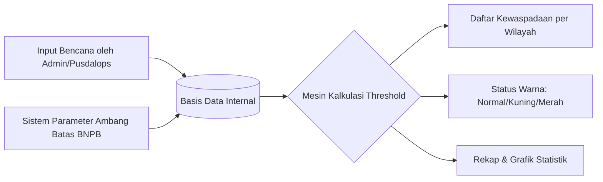

# Dokumentasi Fitur: Threshold BNPB - BARATA
*(Jawa Barat Berbudaya Tangguh Bencana)*

Dokumen ini berisi spesifikasi teknis dan fungsional dari fitur **Threshold BNPB** pada aplikasi BARATA. Fitur ini dirancang untuk memantau frekuensi atau dampak kejadian bencana terhadap nilai ambang batas (threshold) kedaruratan yang ditetapkan oleh Badan Nasional Penanggulangan Bencana (BNPB).

---

## 1. Gambaran Umum Fitur
* **URL Akses**: `https://barata.jabarprov.go.id/threshold`
* **Deskripsi**: Halaman ini menyajikan analisis komparatif antara data kejadian bencana riil di lapangan dengan batas toleransi kerawanan wilayah. Hasil analisis menampilkan status tingkat kewaspadaan suatu daerah dalam kurun waktu tertentu.

---

## 2. Struktur Data & Arsitektur Data Flow

Fitur Threshold BNPB bekerja dengan memproses data historis yang diinput secara berkala:

### Sumber Data Utama:
1. **Input Kejadian Bencana**: Seluruh entitas laporan bencana yang telah divalidasi dan disimpan melalui *Modul Data Bencana* (Fase 1 - Fase 3) oleh admin provinsi maupun kabupaten/kota.
2. **Basis Data Internal**: Menyimpan parameter nilai batas maksimum (threshold) per jenis bencana untuk masing-masing wilayah (Kabupaten/Kota) di Jawa Barat.

---

## 3. Komponen Visual & Layout Halaman

Halaman `threshold` memiliki 3 area fungsional utama:

### A. Panel Filter & Kontrol
Digunakan oleh operator untuk membatasi ruang lingkup analisis data:
1. **Filter Tanggal (`Dari` & `Sampai`)**: Memilih rentang waktu kejadian bencana yang ingin dianalisis.
2. **Filter Kabupaten/Kota**: Dropdown pilihan daerah tingkat II di Jawa Barat.
3. **Filter Jenis Kejadian**: Pilihan klasifikasi bencana (misalnya: *Tanah Longsor*, *Banjir*, *Cuaca Ekstrem*).
4. **Dropdown Limit**: Membatasi jumlah tampilan baris data per halaman (10, 50, 100 baris).
5. **Tombol Filter**: Memicu pencarian ulang berdasarkan parameter filter yang aktif.

### B. Tabel Output Kewaspadaan Wilayah
Menampilkan daftar kompilasi status kerawanan wilayah yang membandingkan akumulasi bencana terhadap nilai ambang batas:

| No | Tgl Kejadian | Kab/Kota | Kejadian | Status Kewaspadaan | Rekap Akumulasi |
|----|--------------|----------|----------|-------------------|-----------------|
| 1  | `DD/MM/YYYY` | Nama Kabupaten/Kota | Jenis Bencana | Badge Warna (Hijau / Kuning / Merah) | Jumlah kejadian aktif dalam periode filter |

### C. Fitur Export Data
* **Export ke Excel (Aktif)**: Mengunduh data tabel yang ter-filter langsung dalam format spreadsheet `.xlsx` untuk kebutuhan analisis offline.
* **Export ke PDF (Rencana Parity)**: Saat ini fungsi cetak laporan PDF diarahkan ke cetak dokumen rekapitulasi penanggulangan (PDF Laporan Bencana utama). Fitur export PDF langsung dari tabel threshold direkomendasikan untuk ditambahkan.

---

## 4. Logika Perhitungan Status Kewaspadaan (Threshold Rules)

Sistem membandingkan jumlah kejadian (`n`) suatu bencana di satu wilayah dalam periode waktu yang dipilih (`t`) terhadap nilai batas standar BNPB (`T`):

1. 🟢 **Status Normal (Hijau)**:
   * **Kondisi**: Akumulasi kejadian bencana di bawah batas minimal kerawanan (`n < T_kuning`).
   * **Arti**: Kondisi wilayah stabil, aman, dan terkendali.
2. 🟡 **Status Waspada (Kuning)**:
   * **Kondisi**: Akumulasi kejadian berada di antara batas minimal dan batas kritis (`T_kuning <= n < T_merah`).
   * **Arti**: Terjadi peningkatan aktivitas bencana. Pusdalops perlu meningkatkan koordinasi dengan relawan lokal dan memantau logistik.
3. 🔴 **Status Awas / Darurat (Merah)**:
   * **Kondisi**: Akumulasi kejadian melebihi batas kritis aman (`n >= T_merah`).
   * **Arti**: Wilayah dinyatakan dalam kondisi darurat kerawanan. Dibutuhkan intervensi langsung dari BPBD Provinsi untuk bantuan logistik, evakuasi, dan aktivasi posko tanggap darurat tingkat wilayah.

---

## 5. Rekomendasi Teknis untuk Re-Engineering

Dalam pengembangan ulang (re-engineering) BARATA menggunakan stack modern (seperti TypeScript, Next.js/Vite, Node.js/Go):

1. **Implementasi Pengelolaan Master Parameter (Threshold Settings Dashboard)**:
   * *Kelemahan Legacy*: Nilai threshold (`T`) sering kali *hardcoded* di basis data atau di file config PHP.
   * *Rekomendasi Modern*: Buat antarmuka CRUD Master Data khusus admin di mana nilai threshold untuk masing-masing Kab/Kota dan jenis bencana dapat diubah secara dinamis tanpa menyentuh kode program.
2. **Kalkulasi Server-Side dengan Caching (Redis/In-Memory)**:
   * *Kelemahan Legacy*: Query penghitungan agregat dari ribuan data bencana memakan waktu lama (high-latency) saat filter tanggal diperlebar.
   * *Rekomendasi Modern*: Gunakan *materialized views* atau mekanisme caching seperti Redis untuk menyimpan hasil kalkulasi akumulasi bencana harian per kabupaten.
3. **Visualisasi Map Layer & Charts**:
   * *Kelemahan Legacy*: Tampilan didominasi oleh tabel data mentah.
   * *Rekomendasi Modern*: Integrasikan status threshold (Hijau/Kuning/Merah) ke dalam peta spasial Jawa Barat (Choropleth Map menggunakan Leaflet/Mapbox). Kabupaten/Kota akan berubah warna secara real-time sesuai status kewaspadaan aktifnya. Tambahkan diagram batang (Bar Charts) rekap jumlah kejadian untuk memudahkan komparasi antar wilayah.
4. **Sistem Notifikasi Awal (Early Warning Notification)**:
   * *Rekomendasi Modern*: Integrasikan trigger otomatis ketika status suatu wilayah berubah dari Kuning ke Merah, sistem mengirimkan webhook notifikasi (via WhatsApp API/Email) ke BPBD Kabupaten/Kota terkait agar segera melakukan kaji cepat.
